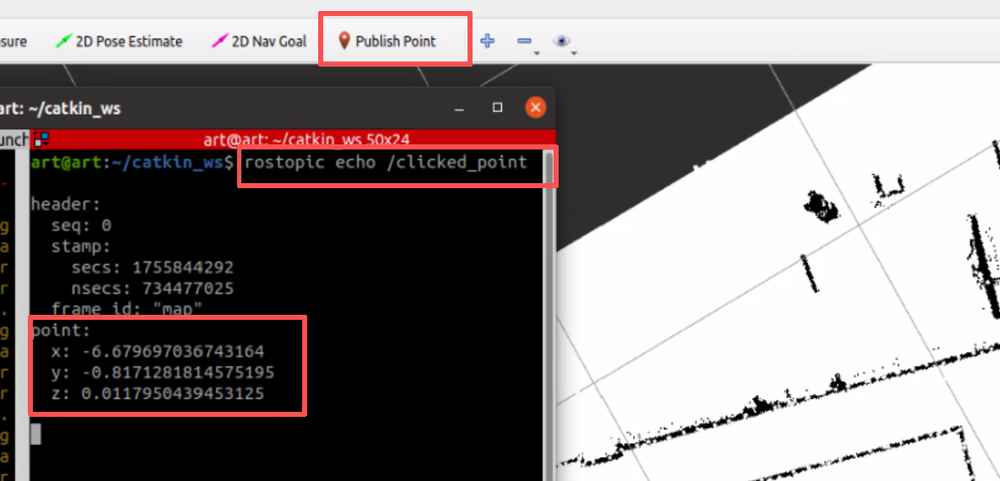

# 环境配置

## 1.简介


- 在软件架构方面，主要由建图算法、定位算法以及导航算法组成，借助车载的4种传感器感知外部环境数据，工控机处理感知数据并运行下行的导航算法。
- 建图方面，通过车载的前后共 2 个mid360 激光雷达获取点云数据，结合内置的 imu ，通过 FAST - LIO - SAM 算法对工厂环境进行预先建图，并保存建图结果，作为导航的初始全局地图。在作业时，激光雷达也会实时感知，将建图数据作为局部代价地图输入给导航模块
- 定位方面，通过车载激光雷达、 RKT 天线，里程计 获取数据，通过 HDL - Localization 算法，与预先建好的全局地图进行比对，以 10 Hz 频率持续与局部地图匹配并实时输出。
- 导航方面，基于 ros 自带的 move_base 架构进行设计，全局规划器采用  A_Star 算法，单次输出单条连续的全局路径，局部规划期基于 rpp 纯跟踪算法进行了优化设计，以全局路径为期望，只做跟踪动作，遇到临时的动态障碍物时，减速或停车等待，始终确保车辆处于全局路径之上，不做多余的避障动作，确保安全。导航部分以多传感器数据作为输入，输出 /cmd_vel 话题给车辆底盘。此外，车辆搭载前后各6各声纳传感器，输入数字信号给上位机，输出速度信息，作为紧急制动的最后保障。为了方便实物调试反馈与自定义路径， 设计了nav_server 节点，发布 xml 格式的离散航点信息给导航模块，订阅导航模块反馈的 警告信息与导航结果。

## 2.环境要求

- Ubuntu 20.04
- ROS Noetic
- 依赖库：
  - PCL
  - OpenCV

## 3.安装依赖

```
# 安装基础依赖
sudo apt-get update
sudo apt-get install -y libpcl-dev libopencv-dev libomp-dev
```

需要克隆的第三方库：

```
[submodule "src/nav_node/src/thirdparty/costmap_prohibition_layer"]
	path = src/nav_node/src/thirdparty/costmap_prohibition_layer
	url = https://github.com/rst-tu-dortmund/costmap_prohibition_layer.git
[submodule "src/nav_node/src/thirdparty/fast_gicp"]
	path = src/nav_node/src/thirdparty/fast_gicp
	url = https://github.com/koide3/fast_gicp.git
[submodule "src/nav_node/src/thirdparty/hdl_localization"]
	path = src/nav_node/src/thirdparty/hdl_localization
	url = https://github.com/koide3/hdl_localization.git
[submodule "src/nav_node/src/thirdparty/hdl_global_localization"]
	path = src/nav_node/src/thirdparty/hdl_global_localization
	url = https://github.com/koide3/hdl_global_localization.git
[submodule "src/nav_node/src/thirdparty/move_base_flex"]
	path = src/nav_node/src/thirdparty/move_base_flex
	url = https://github.com/naturerobots/move_base_flex.git
	branch = noetic
[submodule "src/nav_node/src/thirdparty/navigation_experimental"]
	path = src/nav_node/src/thirdparty/navigation_experimental
	url = https://github.com/ros-planning/navigation_experimental.git
[submodule "src/nav_node/src/thirdparty/teb_local_planner"]
	path = src/nav_node/src/thirdparty/teb_local_planner
	url = https://github.com/rst-tu-dortmund/teb_local_planner.git
[submodule "src/nav_node/src/thirdparty/ndt_omp"]
	path = src/nav_node/src/thirdparty/ndt_omp
	url = https://github.com/koide3/ndt_omp.git
```


# 使用方法

## 1.预建图

通过车载 mid360 激光雷达获取点云数据，结合内置的 imu ，通过 FAST - LIO - SAM 算法对环境进行预先建图，并保存建图结果，作为导航的初始全局地图。

### 1.1 依赖包

```
Livox-SDK2
livox_ros_driver2
FAST_LIO
```

mid360激光雷达配置参考CSDN : 

- [使用Livox-Mid360激光雷达，复现FAST_LIO（保姆级教程）_mid360使用教程-CSDN博客](https://blog.csdn.net/m0_62948300/article/details/140209873?ops_request_misc=&request_id=&biz_id=102&utm_term=livox mid 360   fastlio&utm_medium=distribute.pc_search_result.none-task-blog-2~all~sobaiduweb~default-4-140209873.142^v102^pc_search_result_base8&spm=1018.2226.3001.4187)
- [LIVOX-Mid360雷达配置&&FAST_Lio建图_livox mid360建图-CSDN博客](https://blog.csdn.net/weixin_51995147/article/details/145816188?ops_request_misc=&request_id=&biz_id=102&utm_term=livox mid 360&utm_medium=distribute.pc_search_result.none-task-blog-2~all~sobaiduweb~default-6-145816188.142^v102^pc_search_result_base8&spm=1018.2226.3001.4187)

### 1.2 建图并保存

建图前准备：机器人初始位置不限，但尽量确保机器人朝向为正方向

启动雷达：

```
roslaunch livox_ros_driver2 msg_MID360.launch
```

启动FAST_LIO:

```
roslaunch fast_lio mapping_mid360.launch
```

在 FAST_LIO / PCD 目录下：

```
pcl_viewer scans.pcd
```

查看建图点云结果：


### 1.3 将PCD格式3D点云图转为2D栅格地图

在 `pcd2pgm` 功能包下打开`run.launch `:


launch 关键参数：

```xml
<!-- 半径滤波的半径-->
<param name="thre_radius" value= "0.5" />
<!-- 半径滤波的要求点数个数-->
<param name="thres_point_count" value= "1000" />
```

对于点云中的每一个点，算法会以该点为中心，画一个半径为`thre_radius`的球体，以此界定 “邻域” 的空间范围，统计每个点在`thre_radius`范围内的邻域点数量，若该数量**小于**`thres_point_count`，则判定该点为 “离群点” 并过滤。

```
roslaunch pcd2pgm run.launch
```

等待几秒，出现：


使用 map_server 保存 pgm 文件:

```
rosrun map_server map_saver map:=/map -f /home/art/catkin_ws/src/3rd_party/FAST_LIO/PCD/scans
```

### 1.4 手动去噪

使用GIMP软件对可通行区域建图噪声进行消除：


使用 rviz 查看全局地图：


## 2.预生成路径

### 2.1 Douglas降采样算法

基于道格拉斯 - 普克 (Douglas-Peucker) 算法，通过计算点到线段垂直距离，递归保留超过阈值的点，实现路径降采样，减少点数同时保留形状。

```
roslaunch rpp_pkg path_2_points.launch
```

节点接收 movebase 发布的 global_path（话题名称 "/move_base/GlobalPlanner/plan"），降采样后输出  nav_msgs::Path  消息（话题名称“/downsampled_points”）

```xml

<launch>
    <include file="$(find rpp_pkg)/launch/run_in_real.launch"/>
    <!-- 道格拉斯降采样 -->
    <node name="douglas" pkg="rpp_pkg" type="douglas">
        <param name="douglas_epsilon" value="0.2" />     
    </node> 
</launch>
```

修改 douglas_epsilon 可调整采样阈值：


离散点集以 xml 格式保存在 src/path_point ：

```xml
<douglas_downsample>
  <Waypoint>
    <Name>1</Name>
    <Pos_x>-6.57</Pos_x>
    <Pos_y>-0.8</Pos_y>
    <Pos_z>0</Pos_z>
  </Waypoint>
  <Waypoint>
    <Name>2</Name>
    <Pos_x>-9.86</Pos_x>
    <Pos_y>-11.79</Pos_y>
    <Pos_z>0</Pos_z>
  </Waypoint>
  <Waypoint>
    <Name>3</Name>
    <Pos_x>-19.93</Pos_x>
    <Pos_y>-8.92</Pos_y>
    <Pos_z>0</Pos_z>
  </Waypoint>
</douglas_downsample>
```

### 2.2 自定义路径点

支持用户自定义修改点的位置，添加/删除点、多次插值等，方法：

1. 发布先验地图

2. rviz

   ```
   rviz
   ```

3. 监听话题：

   ```
   rostopic echo /clicked_point
   ```

4. 使用rviz工具 "Publish Point" 在地图上单击：



### 2.3 Bspline 曲线

B 样条曲线算法通过 Cox-deBoor 基函数，结合参数化（均匀、弦长、向心）和 knot 向量生成，以插值或逼近方式获取控制点，进而基于离散点生成平滑轨迹：


相比高次多项式或其他样条（如 Bezier 曲线），B 样条的核心优势在于：

- **局部性**：修改局部控制顶点仅影响局部曲线；
- **灵活性**：通过阶数、节点向量调整光滑性和分段方式；
- **稳定性**：避免高次多项式的 “龙格现象”（振荡）；
- **可扩展性**：支持任意数量的控制顶点，方便复杂曲线建模。

自定义路线：


## 3.定位

通过车载激光雷达、里程计 获取数据，通过 HDL - Localization 算法，与预先建好的全局地图进行比对，以 10 Hz 频率持续与局部地图匹配并实时输出。

### 3.1 全局定位

`hdl_global_localization` 是一个基于 ROS 的全局定位包，支持多种定位算法（BBS、FPFH_RANSAC、FPFH_TEASER），适用于点云数据的全局定位场景。

在`run_in_real.launch` 中的 定位 部分：

```
<!-- 5.定位 -->
  <arg name="localization_rviz" default="false"/>
    <arg name="hdl_rviz" default="true"/>
    <include file="$(find livox_ros_driver2)/launch_ROS1/msg_MID360.launch"/>

    <node pkg="rpp_pkg" type="imu_trans.py" name="imu_trans" />
    
    <!-- hdl_localization -->
    <include file="$(find xj_robot_slam)/launch/3dmap_hdl_localization.launch">
        <arg name="rviz_loca" value="$(arg localization_rviz)" />
        <arg name="rviz_hdl" value="$(arg hdl_rviz)" />
    </include>
```

在`hdl_localization.launch`需要修改激光雷达实际安装位置与机器人 base_link 的 TF 关系：

```xml
 <node pkg="tf" type="static_transform_publisher" name="base_to_laser" args="-0.2 0 -0.15 0 0 0 /body /base_link 1000" />
```

在`PointsCloud2toLaserscan.launch`修改雷达参数：

```
<launch>
        <!-- run pointcloud_to_laserscan node -->
    <node pkg="pointcloud_to_laserscan" type="pointcloud_to_laserscan_node" name="pointcloud_to_laserscan">
        <remap from="cloud_in" to="/livox_pcl0"/>
        
        <rosparam>
            transform_tolerance: 0.01
            min_height: 0           
            max_height: 1.0   
            angle_min: -1.8 # -M_PI/2
            angle_max: 1.8 # M_PI/2
            angle_increment: 0.0087 # M_PI/360.0
            scan_time: 10
            range_min: 0.05
            range_max: 20.0
            use_inf: true
            inf_epsilon: 1.0
            
            concurrency_level: 1
        </rosparam>
    </node>
</launch>
```

## 4.导航

基于 ros 自带的 move_base 架构进行设计，全局规划器采用  A_Star 算法，单次输出单条连续的全局路径，局部规划期基于 rpp 纯跟踪算法进行了优化设计，以全局路径为期望，只做跟踪动作，遇到临时的动态障碍物时，减速或停车等待，始终确保车辆处于全局路径之上，不做多余的避障动作，确保安全。导航部分以多传感器数据作为输入，输出 /cmd_vel 话题给车辆底盘。

依赖包：`nav_core`、`costmap_2d`、`tf2`、`pluginlib`、`tinyxml2`；

### 4.1 全局规划器

2个选项：

1. GlobalPlanner： movebase框架自带的 A 星算法
2. PointGlobalPlanner： 基于离散路径点、bspline曲线生成的固定路线


全局路径规划器`PointGlobalPlanner`继承自`nav_core::BaseGlobalPlanner`接口。其核心功能是：

1. 从 XML 文件读取预定义的路径点
2. 通过 B 样条曲线进行平滑处理
3. 生成符合 ROS 导航规范的全局路径，并按指定频率发布路径供移动机器人的`move_base`节点使用。

### 4.2 局部规划器

局部规划器基于纯跟踪算法（Pure Pursuit），算法参考了人类驾驶行为，其基本思想是：在待跟踪路径上设置预瞄点(goal_ahead)，通过简单的几何方法驱动机器人跟踪预瞄点，随着机器人运动，预瞄点动态移动直至抵达目标位置。


算法利用实时局部障碍物信息、运动学约束和动力学约束设计当前状态下的允许线速度范围 和角速度范围：


全局路径上出现独立于预先建图的临时障碍物（人员、车辆等）时，跳出跟踪，速度归零，停车等待。

关键参数：


### 4.3 使用方法

1. 在`run_in_real.launch` 中的 movebase 部分选择全局规划器：

- A_Star全局规划器：”global_planner/GlobalPlanner“
- 自定义全局规划器："rpp_pkg/PointGlobalPlanner"

2.  可视化调试工具

   ```xml
   <node name="rqt_plot" pkg="rqt_plot" type="rqt_plot"/>                      //检测速度
   <node name="path_visualization" pkg="rpp_pkg" type="path_visualization"/>   //对比规划路径与实际路径
   ```

3. 网线连接，打开激光雷达

4. 打开手柄电源

5. launch

   ```
   cd catkin_ws/
   source ./devel/setup.bash 
   roslaunch rpp_pkg run_in_real.launch 
   ```

6. 在rviz中发布任意位置的目标点
7. 按下手柄 ”A" 按键，开始导航！

## 5.可能出现的问题及解决方案

### 5.1 建图存在残留轨迹

解决方法：增大pcd2pgm.launch中的点云密集参数到900-1000；机器人建图时，人尽量离远；后期用gimp软件扣掉残留点云。

### 5.2 雷达出现残留，局部地图生成错误

解决方法：修改poindcloud2laserscan.launch的最低扫描范围从-1修改为0；


### 5.3 机器人跟踪 yaw 方向震荡

机器人在转弯时调整方向超调，且控制出现震荡，比例控制器前瞻量P过大：


1. 增加前瞻时间，前瞻距离

   ```
       nh.param("lookahead_time", lookahead_time_, 3.0);         //前瞻时间1.5
       nh.param("min_lookahead_dist", min_lookahead_dist_, 0.6); // 最小前瞻距离（单位：米）：前瞻距离不小于该值
       nh.param("max_lookahead_dist", max_lookahead_dist_, 3.0); // 最大前瞻距离
   ```

2. 降低角加速度

   ```
       nh.param("max_w", max_w_, 0.4);  //1.57
       nh.param("min_w", min_w_, 0.0);
       nh.param("max_w_inc", max_w_inc_,0.4);   //1.57
   ```

   